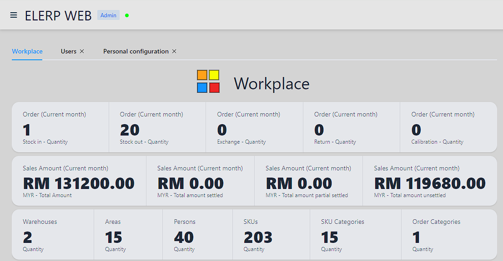

---
# https://vitepress.dev/reference/default-theme-home-page
layout: home

hero:
  name: "Elerp"
  text: Easily manage inventory and orders across multiple warehouses.
  image:
    src: /preview_main_512.png
    alt: Elerp(L)
  tagline: Pay monthly and stop whenever you want.
  actions:
    - theme: brand
      text: Tutorial
      link: /tutorial/quick-start
    - theme: alt
      text: Buy in Shopee
      link: https://shopee.com.my/product/37589189/24765018827/

features:
  - title: Web system
    details: No need to pay for any computer hardware! Visit the website directly to use it!
  - title: Multi-language
    details: Support English, Chinese, Malay!
  - title: Inventory
    details: Multiple warehouse support! Check your inventory easily! Support filtering!
  - title: Orders
    details: Manage your orders and automatically update inventory!
  - title: Statistical
    details: Check out your top 10 most popular products by sales and their total sales!
---

## Preview
### Home page

---

### Statistical

