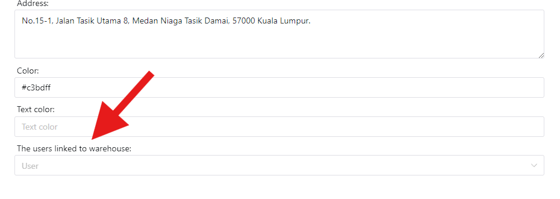

# Tambah Pesanan Pertama
## Memautkan pengguna anda ke gudang
Jika anda mempunyai pengguna umum dan ingin memberi mereka kebenaran untuk menambah pesanan, anda mungkin telah mendayakan kebenaran "Tambah Pesanan" untuk pengguna tersebut, hanya untuk mendapati bahawa pengguna tidak dapat mencari mana-mana gudang.   Ini kerana setiap gudang disembunyikan secara lalai dan anda mesti memautkan pengguna ke gudang yang ditentukan sebelum pengguna boleh mengakses gudang tersebut.



## Maklumat Pesanan
Lajur pesanan adalah seperti berikut:
- `Jenis Pesanan` ialah jenis pesanan.
     - `Stok Masuk` ialah stok mengikut susunan. Digunakan apabila anda mahukan stok dalam produk.
     - `Stok Keluar` ialah pesanan kelur stok. Selalunya digunakan.
     - `Pemulangan` ialah pesanan pemulangan. Digunakan apabila anda ingin memulangkan beberapa produk. Ia melakukan perkara yang sama seperti `Stok Masuk` tetapi dengan bendera `Kembali`.
     - `Exchange` ialah pesanan pertukaran. Digunakan apabila anda ingin menukar beberapa produk. Contohnya, pelanggan anda memulangkan `Cola` kepada anda dan menukarnya dengan `Sarsi`.   Jadi inventori anda akan menjadi +1 untuk `Cola` dan -1 untuk `Sarsi`.
     - `Penentukuran` sedang menentukur inventori anda. Sila gunakan dengan berhati-hati. Biasanya kerana inventori anda ditambah atau dikurangkan atas sebab-sebab khas dan bukan milik `Stok Masuk`/`Stok Keluar`, anda boleh menggunakan `Penentukuran` untuk terus menukar inventori produk yang ditentukan kepada perkara yang anda inginkan.
     - `Calibration Strict` sedang menentukur inventori anda. Ia melakukan perkara yang sama seperti `Penentukuran` tetapi ia adalah ketat! Tukar inventori produk yang ditentukan kepada perkara yang anda mahukan dan produk lain akan bertukar kepada **sifar**!
     - `Pengesahan` digunakan untuk mengesahkan inventori anda. Selamat digunakan, tiada apa yang akan berlaku.
     - `Verification Strict` digunakan untuk mengesahkan inventori anda. Tetapi ia adalah ketat! Inventori produk yang tidak dinyatakan mesti **sifar**. Selamat digunakan, tiada apa yang akan berlaku.
- `Hanya rekod` hanya merekodkan pesanan dan tidak melakukan sebarang operasi pada inventori.
- `Kategori Pesanan` ialah kategori pesanan. Sebagai contoh, anda boleh menambah kategori `Umum` untuk semua susunan am.
- `Gudang` ialah gudang yang memproses pesanan ini. Ia akan mengira inventori gudang sasaran.
- `Person Related` ialah orang yang berkaitan dengan pesanan ini. Jika anda seorang penjual semula, anda boleh menambah maklumat pelanggan anda sebelum ini. Jadi ruangan ini adalah siapa yang membuat pesanan. Jika tidak, anda hanya boleh menambah orang untuk "Semua Pelanggan" dan pilih orang ini
- `Penerangan` adalah pilihan. Tulis penerangan anda untuk pesanan ini.
- `Mata wang` ialah mata wang yang digunakan dalam tertib ini.
- `Item` ialah barang pesanan. Tambah produk pesanan anda di sini. Kosong dibenarkan.
     - Pilih SKU produk.
     - Tulis harga produk.
     - Tulis kuantiti produk.

::: tip
Anda mahu menambah berbilang sekali? Anda boleh mengklik butang `Tambah berbilang item`. Dalam modal, pilih kategori SKU yang anda mahu tambah, tulis item dengan format yang ditentukan:
```
Ais kola 4
Ais sarsi 2
```
Tulis harga anda, contohnya `5`, Ia akan menambah 4 ais cola, 2 ais sarsi dengan harga 5.

**Memandangkan sesetengah SKU mungkin mempunyai nama yang sama tetapi kategori berbeza, anda perlu memilih kategori SKU.**
:::

::: warning
Semua pesanan boleh disemak untuk melihat sama ada inventori berpuas hati sebelum menambah, dan akan disemak semula dalam sistem selepas mengklik tambah. Tetapi semakan manual dengan cepat boleh memberikan maklumat yang mencukupi tentang produk mana yang tidak berpuas hati.
:::