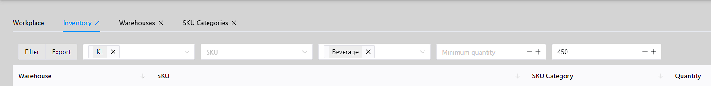
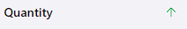
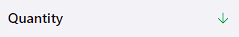

# Semak inventori
## Penapisan
Anda boleh menyemak keputusan dengan menapis. Sebagai contoh, anda ingin menyemak inventori gudang `KL` dan hanya menyemak produk dengan kategori SKU `Minuman` dan kurang daripada `450`.   Anda boleh melakukan ini:

Kemudian klik `Tapis` untuk mendapatkan keputusan.

## Menyusun
Anda boleh menyemak keputusan dengan mengisih. Contohnya, jika anda ingin mengisih mengikut kuantiti dalam tertib menaik, klik lajur `Kuantiti`:
::: tip Tidak ditetapkan, lalai

:::

::: tip Tertib menaik

:::

::: tip Susunan menurun

:::

## Eksport
Anda boleh mengeksport hasil inventori ke fail `xlsx`. Hasilnya ialah sokongan untuk penapisan dan pengisihan.

Untuk melakukan ini, klik butang `Eksport`.

