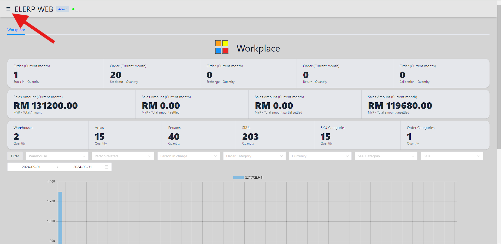
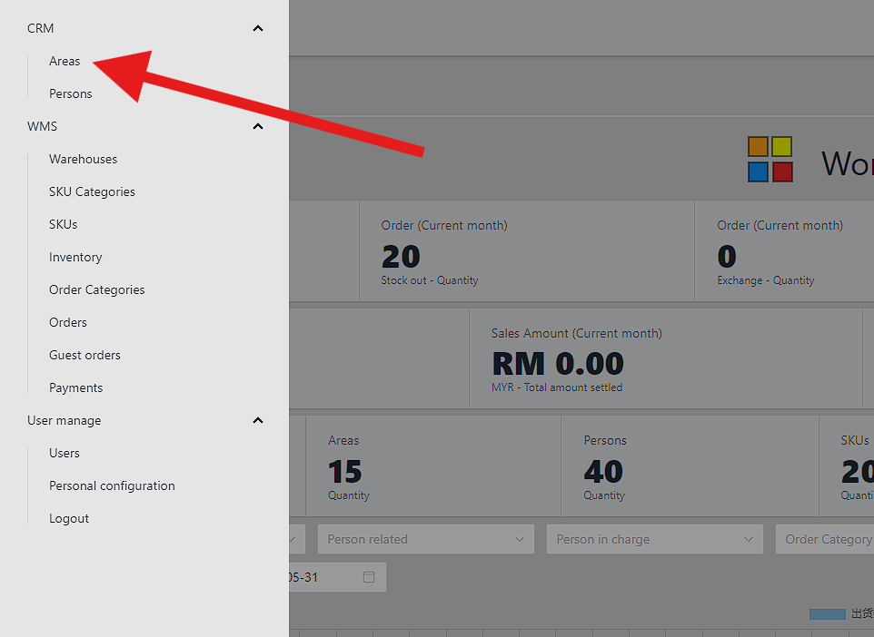

# Permulaan pantas
## Antara muka
Klik butang menu di penjuru kiri sebelah atas untuk membuka menu.

Dan klik untuk memasuki antara muka yang ditentukan.

## Pergantungan
Sebelum menambah pesanan pertama, mari tambah yang berikut, sekurang-kurangnya satu setiap satu.
- Kawasan
- Orang
- Gudang
- Kategori Pesanan
- Kategori SKU
- SKU

Setiap kebergantungan di atas akan mempunyai dua lajur:
- `Warna` adalah pilihan. Ia adalah warna latar belakang pergantungan. Lalai ialah kelabu.
- `Warna Teks` adalah pilihan. Ia adalah warna teks pergantungan. Lalai ialah hitam.

## Tambah Kawasan
- `Nama` diperlukan. Ia adalah nama kawasan.
- `Penerangan` adalah pilihan.

## Tambah Orang
- `Nama` diperlukan. Ia adalah nama kawasan.
- `Penerangan` adalah pilihan.
- `Orang yang bertanggungjawab` adalah pilihan. Ia adalah orang yang bertanggungjawab untuk orang ini.
- `Kawasan` diperlukan. Ia adalah kawasan orang.
- `Alamat` adalah pilihan. Ia adalah alamat orang.
- `Nombor hubungan` adalah pilihan. Ia adalah nombor hubungan orang.
- `E-mel` adalah pilihan. Ia adalah e-mel orang.

## Tambah Gudang
- `Kawasan` diperlukan. Ia adalah kawasan gudang.
- `Orang yang bertanggungjawab` diperlukan. Ia adalah orang yang bertanggungjawab untuk gudang ini.
- `Nama` diperlukan. Ia adalah nama gudang.
- `Penerangan` adalah pilihan.
- `Alamat` adalah pilihan. Ia adalah alamat gudang.

## Tambah Kategori SKU
- `Nama` diperlukan. Ia adalah nama kategori SKU.
- `Penerangan` adalah pilihan.

## Tambah SKU
- `Kategori SKU` diperlukan. Ia adalah kategori SKU.
- `Nama` diperlukan. Ia adalah nama SKU.
- `Penerangan` adalah pilihan.

## Tambah Kategori Pesanan
- `Nama` diperlukan. Ia adalah nama pesanan.
- `Penerangan` adalah pilihan.