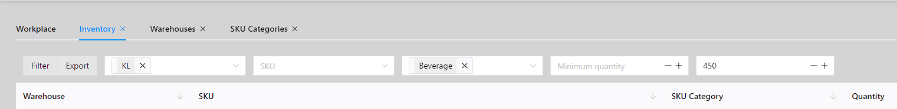
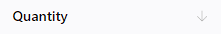
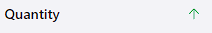
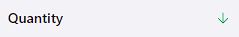
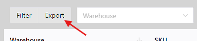

# Check the inventory
## Filtering
You can check the results by filtering. For example, you want to check the inventory of warehouse `KL` and only check products with SKU category `Beverages` and less than `450`.  You can do this:

Then click `Filter` to get the results.

## Sorting
You can check the results by sorting. For example, if you want to sort by quantity in ascending order, click the `Quantity` column:
::: tip Not set, default

:::

::: tip Ascending order

:::

::: tip Descending order

:::

## Export
You can export the inventory results to an `xlsx` file. The result is support for filtering and sorting.

To do this, click the `Export` button.

