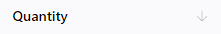
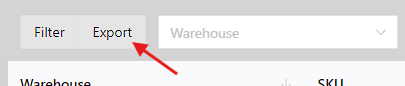

# 检查库存
## 筛选
您可以通过过滤来检查结果。例如，您想查询仓库`KL`的库存，只查询SKU类别`饮料`且小于`450`的产品。你可以这样做：

然后单击`筛选`即可获取结果。

## 排序
您可以通过排序来检查结果。 例如，如果您想按数量升序排序，请单击`数量`列：
::: tip 未设置，默认

:::

::: tip 升序

:::

::: tip 降序

:::

## 导出
您可以将清单结果导出到`xlsx`文件。 结果是支持筛选和排序。

为此，请单击`导出`按钮。

