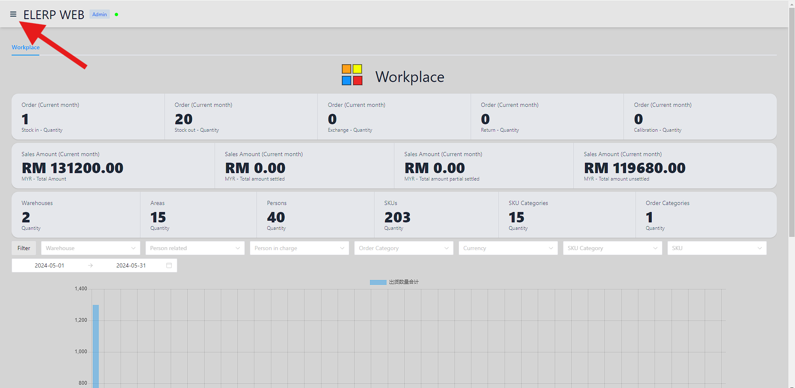

# 快速开始
## 界面
单击左上角的菜单按钮打开菜单。

然后点击进入指定界面。

## 依赖项
在添加第一个订单之前，让我们添加以下内容，每个至少一个。
- 区域
- 人
- 仓库
- 订单类别
- SKU类别
- SKU

上面的每个依赖项都有两列：
- “颜色”是可选的。 它是依赖的背景颜色。 默认为灰色。
- “文本颜色”是可选的。 它是依赖的文本颜色。 默认为黑色。

## 添加区域
- `姓名`为必填项。 这是该地区的名称。
- `描述`是可选的。

## 添加人员
- `姓名`为必填项。 这是该地区的名称。
- `描述`是可选的。
- `负责人`是可选的。 是这个人的负责人。
- `区域`为必填项。 是人的领域。
- `地址`是可选的。 是人的地址。
- `联系电话`是可选的。 是人的联络号码。
- `电子邮件`是可选的。 是本人的电子邮件。

## 添加仓库
- `区域`为必填项。 是仓库面积。
- 需要`负责人`。 是这个仓库的负责人。
- `姓名`为必填项。 这是仓库的名字。
- `描述`是可选的。
- `地址`是可选的。 是仓库地址。

## 添加 SKU 类别
- `姓名`为必填项。 这是 SKU 类别的名称。
- `描述`是可选的。

## 添加 SKU
- `SKU 类别`为必填项。 这是SKU的类别。
- `姓名`为必填项。 这是 SKU 的名称。
- `描述`是可选的。

## 添加订单类别
- `姓名`为必填项。 这是订单的名称。
- `描述`是可选的。